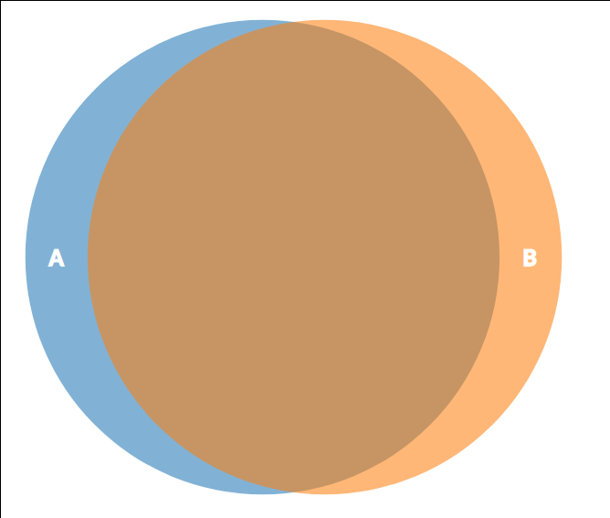

# pandas-distinct

## The problem

Given two sets (`DataFrame`) A and B, we want obtain the difference (rows)
which aren't part of the intersection. In other words, we want the disjoint set
of both.




### An example

The problem doesn't seems to be so hard but has a lot of cases:

Notice:

- The index can be repeated.
- The index or elements can be in different order.
- We want take in account the repetition (multiset).


#### Simple example

```python
>>> import pandas as pd
>>> import pandas_distinct

>>> left = pd.DataFrame([
...     [1, 2, 3],
...     [1, 2, 33]           # diff <---+
... ])

>>> right = pd.DataFrame([
...     [1, 2, 3],
...     [1, 2, 3]            # diff <---+
... ])

>>> left_obtained, right_obtained = pd.distinct(left, right)

>>> left_obtained
   0  1   2
1  1  2  33

>>> right_obtained
   0  1  2
1  1  2  3

```


### More complex example

```python

>>> left = pd.DataFrame([
...     [1, 2, 3],    # a
...     [1, 2, 3],    # a
...     [1, 2, 33]],  # b
...     index=["a", "a", "b"],
... )

>>> right = pd.DataFrame([
...     [1, 2, 3],    # a
...     [1, 2, 33]],  # b
...     index=["a", "b"],
... )


>>> left_diff, right_diff = pd.distinct(left, right, subset=[1, 2])

>>> left_diff
   0  1  2
a  1  2  3

>>> right_diff
Empty DataFrame
Columns: [0, 1, 2]
Index: []
```


### Keeping set's operation intact


We can see this operation when we are operating with sets:

```python
>>> left = {1,2,3}
>>> right = {1,3}
>>> left - right
{2}
>>> right - left
set()
```

## Alternative implementation

### Using counter!


```python
from collections import Counter
import pandas as pd


Counter()

left = pd.DataFrame([
    [1, 2, 3],  # a
    [1, 2, 3],  # a
    [1, 2, 33]  # b
    ],
    index=["a", "a", "b"],
)
right = pd.DataFrame([
    [1, 2, 3],  # a
    [1, 2, 33]  # b
    ],
    index=["a", "b"],
)

left_expected = pd.DataFrame([
    [1, 2, 3], # a
    ],
    index=["a"],
)
right_expected = pd.DataFrame([], columns=[0, 1, 2], index=[])


left_counter = Counter(left.itertuples(index=False))
right_counter = Counter(right.itertuples(index=False))

left_counter - right_counter
right_counter - left_counter

left_obtained, right_obtained = utils.distinct(left, right, subset=[1, 2])
```

# Install

```bash
pip install git+https://github.com/mmngreco/pandas-distinct
```
